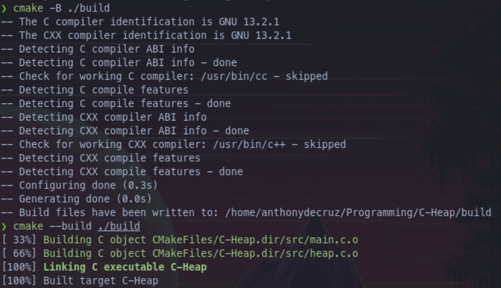

# C-Heap
An implementation of a heap, along with functions `malloc()` and `free()`, in C.
### Build
Build with:
```sh
cmake -B ./build
cmake --build ./build
```


Run the example with:
```sh
./build/C-Heap
```

### Project
- [x] Complete initial implementation
- [ ] Refactor code documentation
- [ ] Optimise code
- [ ] Provide documentation on how the system works

